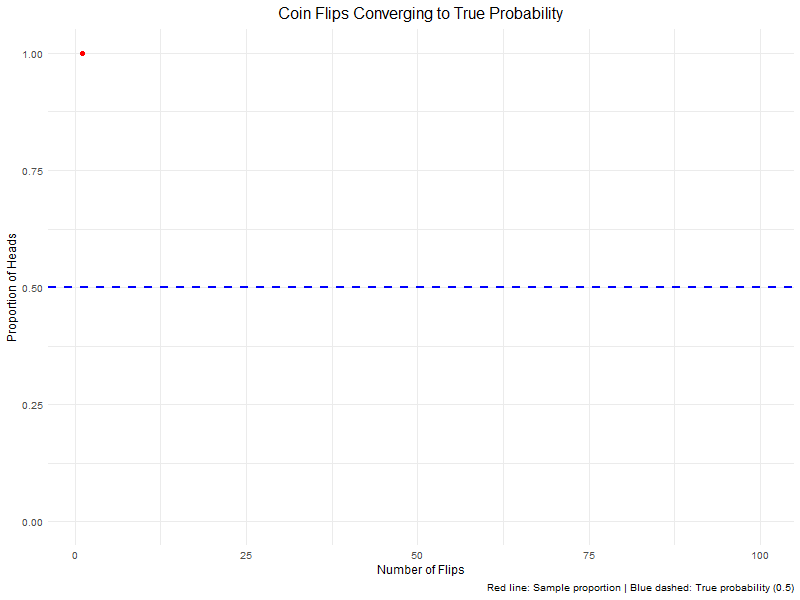

 

Benjamin Franklin quipped that it is "better to be thought the fool than open your mouth and remove all doubt". That might be good advice for seeming wise, but it's a terrible way learn anything. I'd rather open my mouth and try to remove some doubt than remain the fool. 

<section>
  <h2 style = "font-size: 1.5rem;">University of Chicago</h2>
  <ul>
      <strong>Politics of the American Presidency (PLSC 10400): </strong> Teaching Assistant, Winter 2026  
      <button onclick="var a=this.nextElementSibling;a.style.display=a.style.display==='block'?'none':'block';this.textContent=this.textContent==='Details ▼'?'Details ▲':'Details ▼';" style="margin-top:0.1rem;background:none;border:none;color:#8080cc;padding:0.25rem 0;cursor:pointer;font-family:inherit;font-size:0.9rem;">Details ▼</button>
    

      
<strong>Level: </strong>  Undergraduate 

      
<strong>Instructor: </strong>  Jon Rogowski 

      
<strong>Description: </strong> This course surveys the politics of presidential power. We consider the demands and constraints of the presidency as an institution, its origins and historical development, interactions with Congress, the courts, the bureaucracy, and the public. We cover the influence presidents wield in domestic and foreign policymaking, and the ways in which presidents make decisions in a system of separated powers. 

       
<strong>Syllabus </strong>

       

     </ul>  
  

  <ul>
      <strong> Intro to Quantitative Social Science (PLSC 30500): </strong>  Teaching Assistant, Fall 2025  
      <button onclick="var a=this.nextElementSibling;a.style.display=a.style.display==='block'?'none':'block';this.textContent=this.textContent==='Details ▼'?'Details ▲':'Details ▼';" style="margin-top:0.1rem;background:none;border:none;color:#8080cc;padding:0.25rem 0;cursor:pointer;font-family:inherit;font-size:0.9rem;">Details ▼</button>
    

      
<strong>Level: </strong>  PhD 

      
<strong>Instructor: </strong>  Isaac Melhaff 

      
<strong>Description: </strong> This course introduces skills and concepts to enable graduate students to produce quantitative social science research. These include the basic foundations of probability and statistics, challenges and common approaches to the problem of estimation, statistical inference and measures of uncertainty, how to translate the results of statistical tests into substantive conclusions about the political and social world, and how to use the R programming language for statistical problems. 

       
<strong>My labs</strong>

       
<strong>Syllabus</strong>

      

  </ul>
   

  <ul>
      <strong>PLSC 49999 Math Camp: </strong> Coding Instructor, Summer 2025  
      <button onclick="var a=this.nextElementSibling;a.style.display=a.style.display==='block'?'none':'block';this.textContent=this.textContent==='Details ▼'?'Details ▲':'Details ▼';" style="margin-top:0.1rem;background:none;border:none;color:#8080cc;padding:0.25rem 0;cursor:pointer;font-family:inherit;font-size:0.9rem;">Details ▼</button>
    

      
<strong>Level: </strong>  PhD 

      
<strong>Description: </strong> This is the preparatory math and coding background for incoming PhD students intending to do empirical work in political science. I led the coding portion, focused on R. We went from total unfamiliarity to being prepared for graduate-level coursework in quantitative methods. Topics covered include objects and boolean logic, packages and functions, tidyverse and data manipulation, data visualization, compiling and LaTeX, loops, Monte Carlo simulation, expectation, variance, and covariance, central limit theorem, the law of large numbers, the basics of distributions. My students/friends are making great use of this foundation. 

      
<strong>Resources</strong>

      
      

  </ul>
</section>
  
 <section>
  <h2 style = "font-size: 1.5rem;">University of North Carolina</h2>
   <ul>
   <strong>PLCY 310 Microeconomic Foundations of Public Policy</strong>: Tutor, Spring 2022 
   </ul>
    <ul>
   <strong>POLI 271 Modern Political Thought</strong>: Teaching Assistant, Summer 2020 
    </ul>
  </section>

  
  </ul>
</section>
